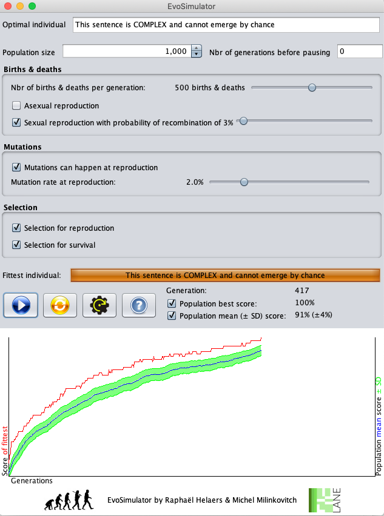

# EvoSimulator

The ‘EvoSimulator’ program makes it possible to experience in a simple way (by means of numerical simulations) the relative importance of basic evolutionary mechanisms (mutation, selection and recombination) in the emergence of complexity.
The individuals of the simulated species are represented by their ‘genome’ of fixed size and composed of characters. Instead of using a 4-letter alphabet (A, C, G, and T), we use a much richer alphabet (81 possible characters) covering all the letters of the Latin alphabet (upper and lower case letters, with or without accents), the 10 digits and some special characters (including the 'blank'):
[`aàAbBcçCdDéeèEfFgGhHiIjJkKlLmMnNoOpPqQrRsStTuùUvVwWxXyYzZ 0123456789,.?!'\"()`].

The number of different possible sentences (genomes) depends on the size of the target sentence (chosen by the user). By default, the target genome is:

*This sentence is COMPLEX and cannot emerge by chance*

This sentence is 52-character long. The possible number of genomes of 52 characters using an alphabet of 81 possible characters is equal to 81 ^ 52> 1.7x10 ^ 99 ... that is, a number very much greater than the number of particles in the universe. It would take virtually infinite time for a computer to generate all possible sentences and therefore generate the target sentence with certainty. Chance alone cannot generate complexity.

… But everything changes if we bring in the mechanism of Darwinian selection. The fitness of each individual is measured objectively by the proximity of the sequence of characters to a "target sentence" (of maximum fitness). To do this, EvoSimulator calculates, for each generated genome, a score which represents the proportion of characters identical to the target genome. Note that a character is only identical if it is also in the same position in the sentence. For example, if an individual has a score of 60%, this means that 60% of the positions in its genome are identical to the characters at the same positions in the target genome and that 40% are different. Note that "a", "à" and "A" are different characters!

Before starting a simulation, the population size (by default 1000 individuals) must be determined. It will remain fixed over time because, at each new generation, the number of individuals that will die will be the same as the number of individuals that will get born.

The parameters that you can control are the following:
- Panel ‘Births & deaths’:
At each generation, a certain number of deaths and births take place (by default 500, the slider "Number of births & deaths per generation" allows you to modify this value). As previously indicated, there will be as many births as there are deaths, so that the population size remains stable. In the same panel, you can control reproduction type: asexual (an individual who reproduces creates a copy of itself) or sexual with recombination (2 individuals are chosen as parents and give birth to a child whose genome will be a mixture of the two parental genomes).
- Panel ‘Mutations’ :
During reproduction, the genome of the parent(s) is (are) copied character by character to form the new individual (i.e., the child). If you check the ‘mutations’ box, there is a probability (by default 2%, the "mutation rate" slider allows this value to be modified) for each copied character to write a random character instead. If you uncheck the box, no mutation will be generated, and the characters will always be copied without error.
- Panel ‘Selection’ :
Selection can be applied to the choice of individuals who reproduce and / or to the choice of individuals who die (depending on the box(es) checked).
If selection is applied during reproduction, each individual has a probability proportional to its score to be chosen to reproduce, otherwise it is chosen at random. If selection is applied during survival, each individual has a probability inversely proportional to its score to be chosen to die, otherwise it is chosen at random.

In practice, when a simulation is launched, the generations accumulate until a generated individual corresponds to the target sentence (the simulation then stops). Within each new generation, a certain number of birth / death events take place sequentially ("Number of births & deaths by generation") and in the following manner:
- An individual is selected to reproduce (2 individuals in the case of sexual reproduction). If there is selection on reproduction, each individual has a probability proportional to its score to be chosen, otherwise it is chosen at random.
- The child is generated. In the event of asexual reproduction, the parent is duplicated. In the case of sexual reproduction, the genome with the highest score (among the genomes of both parents) is copied character by character, but after each character copied there is a probability (3% by default, the slider "... probability of recombination" allows to change this value) that the reading / copying moves on the genome of the other parent for the following characters. For each character, there is the same probability of going back to the other parent, and so on.
- If the user chooses that mutations can occur, each copied character from a parent in the child has a probability of being replaced by a random character.
- An individual is selected to die. If there is selection on survival, each individual has a probability inversely proportional to its score to be chosen, otherwise it is chosen at random. The individual selected to die is removed from the population and replaced by the individual generated above.

Note that:
- A child produced in generation i will cannot be selected to reproduce at the same generation i (a new born must wait one generation before it can reproduce). On the other hand, a child produced at generation i can be selected to die at the same generation i.
- Selection is a probabilistic process. For example, imagine a population of 4 individuals with scores of 80%, 60%, 40% and 20%, respectively. In case of selection on reproduction, at each event, individuals 1, 2, 3, and 4 have respectively 40%, 30%, 20% and 10% chances of being chosen to reproduce. In case of selection on survival, at each event, individuals 1, 2, 3, and 4 have a 10%, 20%, 30% and 40% chance of being chosen to die, respectively.

The controls on the currently running simulation are as follows:
- At each generation, the genome (= sentence) of the fittest individual is displayed with its score (the box is filled in proportion to the relative score). The graph saves this best score for the corresponding generation.
- The mean score of the population and corresponding standard deviation are also displayed.
- Checkboxes allow the user to display/hide these two curves.
- During the simulation, the user can press the start/pause button to resume/pause the run.
- During the simulation, the user can modify any parameter so that it is immediately taken into account (with the exception of the population size, which must be modified in pause mode).
- The second button is used to restart the simulation at the generation zero.
- The third button allows you to reset the default settings.
- The box "Nbr of generations before pausing" next to the population size panel allows automatically pausing the simulation every X generations.

## Creators
Raphaël Helaers & Michel C. Milinkovitch, 2007 et 2020

https://www.lanevol.org

## Screenshot

